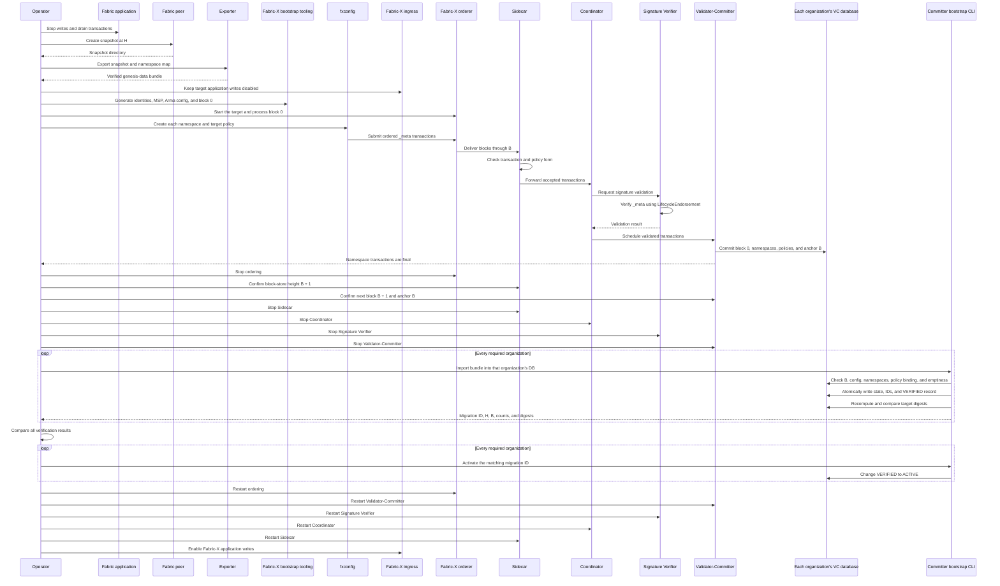
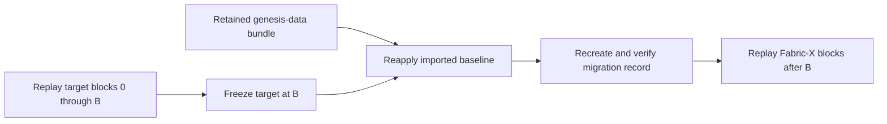

- Feature Name: fabric_classic_snapshot_migration_to_fabric_x
- Start Date: 2026-08-04
- RFC PR: (leave this empty)
- Fabric Component: Fabric Classic peer ledger, Fabric-X committer
- Fabric Issue: https://github.com/LF-Decentralized-Trust-Mentorships/mentorship-program/issues/65

# Summary
[summary]: #summary

This RFC defines an offline migration from Hyperledger Fabric Classic to
Fabric-X. An official Fabric peer snapshot at source height `H` is the source of
truth. A Go exporter validates the snapshot, maps channels and chaincode
namespaces to Fabric-X networks and namespaces, excludes unsupported private
data artifacts, and writes a deterministic genesis-data bundle. The Fabric-X
committer imports the bundle into a new target in one atomic transaction. It
records and verifies the result, then blocks further imports once the operator
activates the target.

The initial topology maps one Fabric channel to one Fabric-X network. Fabric-X
currently supports one channel per network and multiple namespaces inside that
channel. The migration preserves current public state and transaction IDs for
anti-replay. It does not copy Fabric block history, transaction envelopes,
historical values, private collection values, channel configuration bytes, or
classic chaincode packages.

An official peer snapshot does not contain Fabric transaction or block
history. This RFC therefore preserves current state and the transaction-ID
anti-replay baseline, while requiring the source ledger archive for historical
audit and queries. It does not claim to reconstruct transactional history from
data that the snapshot does not contain.

# Motivation
[motivation]: #motivation

Fabric-X is a separate, high-throughput implementation within the Fabric
ecosystem. Its microservice architecture, single-channel network model,
namespace storage, distributed SQL state database, and Fabric Smart Client
(FSC) or custom-endorser programming model are not drop-in replacements for a
Fabric Classic peer.

Existing Fabric deployments need a defined transition boundary before they can
evaluate Fabric-X for production use. A direct database copy is not sufficient:

* Fabric state is organized by channel, chaincode namespace, and private-data
  collection, while Fabric-X uses one channel per network and application
  namespaces.
* A Fabric peer snapshot contains current state and transaction IDs, but not
  the complete blockchain or private collection values.
* Fabric-X creates its own block `0`, MSP configuration, ordering topology,
  namespace policies, and block history.
* Imported state is not produced by Fabric-X transactions and therefore cannot
  be reconstructed by replaying target blocks alone.

The toolchain fails closed. Its output lists the included values, exclusions,
mappings, integrity checks, and known losses. The design favors offline
correctness and recovery over a zero-downtime cutover.

# Guide-level explanation
[guide-level-explanation]: #guide-level-explanation

## Terms

* **Source checkpoint `H`:** the last Fabric block represented by the peer
  snapshot.
* **Genesis-data bundle:** the portable, source-derived file emitted by the
  exporter. It is not a block.
* **Target block `0`:** the native Fabric-X configuration block for the new
  network.
* **Target bootstrap anchor `B`:** the last Fabric-X block committed after
  namespace creation and before state import.
* **Migration ID:** the identity of one logical bootstrap operation.
* **Migration record:** durable target-side metadata describing what was
  imported, into which target and anchor, and whether it is `VERIFIED` or
  `ACTIVE`.

Source height `H` and target anchor `B` are unrelated. Fabric blocks are not
renumbered or copied into Fabric-X.

## Migration flow

For each source channel, an operator performs these steps:

1. Stop new writes to the Fabric application and allow in-flight transactions
   to finish.
2. Select source height `H`, capture peer snapshots, and confirm the required
   peers agree on the checkpoint.
3. Run the exporter. It validates snapshot hashes and format, classifies the
   content, applies deterministic mappings, and creates the genesis-data
   bundle.
4. Generate Fabric-X identities, MSP material, Arma configuration, and target
   block `0` through existing Fabric-X tooling.
5. Start the target with application ingress disabled and process block `0`
   normally.
6. Create every application namespace and policy through normal ordered
   `fxconfig namespace create` transactions.
7. Stop target ordering after the namespace transactions reach finality. Drain
   the committer pipeline, stop its write-side services, and record the actual
   target anchor `B`. The Sidecar block-store height must equal `B + 1`, and
   every application namespace must exist and contain zero application rows.
8. Verify the bundle, effective target configuration at `B`, anchor `B`,
   namespace map, installed policies, and empty-target preconditions.
9. In one serializable database transaction, load public state and transaction
   IDs, recompute the stored counts and digests, create the `VERIFIED` migration
   record, and commit. Any failure rolls back all three.
10. Run the target verifier against the retained bundle and target database.
11. Compare every required committer organization's migration ID, `H`, `B`,
    configuration, map, policy, state, and transaction-ID digests. Each
    organization then sets its local migration record to `ACTIVE`. Enable
    application ingress only after all required records are `ACTIVE`.



The committer reads anchor `B`, namespace policies, the configuration-state
digest, and empty-target preconditions from its configured database. It does
not trust operator-supplied values for these checks. Version `1` binds the
effective configuration at `B`, not the exact serialized block `0`. The
effective configuration is what governs the imported state; adding Sidecar
block-store coupling only to retain the raw block hash is outside this version.

## Component boundaries

The table assigns each step to one component and states what falls outside its
boundary.

| Component | Consumes | Produces | Does not do |
| --- | --- | --- | --- |
| Fabric application and operator | Cutover decision | Quiesced source ledger | Create or interpret snapshot files |
| Fabric peer | Ledger committed through `H` | Official peer snapshot directory | Map namespaces or contact Fabric-X |
| Exporter | Snapshot directory and explicit namespace map | Canonical genesis-data bundle | Create Fabric-X configuration, policies, or database rows |
| Fabric-X bootstrap tooling | Target membership and ordering inputs | Identities, MSP material, Arma configuration, and block `0` | Read the source snapshot or bundle |
| `fxconfig` | Target namespace IDs and approved policies | Ordered `_meta` namespace transactions | Import application state |
| Orderer | Fabric-X transactions | Ordered target blocks | Import the bundle or decide source-to-target policy equivalence |
| Sidecar | Ordered blocks | Structurally checked transactions for the Coordinator | Approve the migration or map source namespaces |
| Coordinator | Accepted transactions and policy updates | Scheduled validation and commit work | Validate signatures or write ledger state |
| Signature Verifier | Transactions and installed Fabric-X policies | Signature-validation results | Translate Fabric Classic policies or write state |
| Validator-Committer | Validated target transactions | Block `0`, namespace policies, empty namespace tables, and anchor `B` in its database | Read or import the genesis-data bundle during normal block processing |
| Committer bootstrap CLI | Verified bundle and stopped empty target database at `B` | Public state, migrated transaction IDs, and `VERIFIED` migration record in one transaction | Create block `0`, namespaces, policies, or target blocks |
| Committer verification and activation commands | Retained bundle and migration record | Recomputed integrity result, then `ACTIVE` status | Rewrite imported state or advance target height |

The source path ends at the genesis-data bundle. The normal Fabric-X path ends
at an empty, configured database anchored at `B`. Only the offline committer
bootstrap joins those inputs. It validates the installed target policy's
supported encoding and binds its exact bytes and version; it does not translate
or prove equivalence with a Fabric Classic endorsement policy.

## What is preserved

The migration preserves:

* current public application keys and values;
* empty public-state metadata, with non-empty metadata rejected in version `1`;
* original Fabric key versions as provenance;
* Fabric transaction IDs through `H` for duplicate detection;
* deterministic channel-to-network and namespace mappings;
* source metadata, file hashes, counts, and canonical digests;
* an explicit inventory of excluded private-data artifacts.

Imported application keys begin at target version `0`. Fabric
`(block, transaction)` versions are retained as provenance and are not
reinterpreted as Fabric-X counters.

## What is not preserved

The migration does not preserve:

* Fabric blocks, transaction envelopes, validation codes, or transaction
  positions;
* historical key values;
* private collection values, because they are absent from the peer snapshot;
* private-data hashes as Fabric-X application values;
* collection configuration history as application state;
* Fabric channel configuration bytes;
* classic chaincode packages, containers, events, or history-query behavior;
* uninterrupted transaction processing during cutover.

The tools report these omissions as migration results, not optional warnings.

Unsafe conditions are errors, for example:

```text
target advanced beyond bootstrap anchor: expected 1, found 2
namespace basic is not empty
namespace basic policy digest does not match the migration plan
migration migration-2026-08-04 is already active
```

## Repeated imports

A bundle is imported once per target baseline, not once globally.

* A crash before the atomic commit leaves no imported rows, transaction IDs,
  or migration record; the same command may start again from `ABSENT`.
* Repeating the command after `VERIFIED` returns an idempotent success and
  does not rewrite state.
* Verification may be repeated.
* Each required committer organization imports the same approved bundle into
  its own database before activation.
* Recovery may reapply the same bundle after reconstructing a clean target at
  anchor `B`.
* An `ACTIVE` target rejects every bootstrap import, including the same
  bundle.
* A newer Fabric snapshot is not layered on an earlier import. Before
  activation, the target must be rebuilt or explicitly reset and bootstrapped
  with a new migration ID. Incremental migration is out of scope.

## Multiple source channels

Version `1` maps each Fabric channel to its own Fabric-X network. Each network
has one Fabric-X channel. Its namespaces share ordered history, membership, and
governance; they do not reproduce Fabric channel membership, block visibility,
or ledger isolation.

Channel consolidation may be considered later only when membership,
visibility, governance, and future-change rules are proven equivalent.

# Reference-level explanation
[reference-level-explanation]: #reference-level-explanation

## Invariants

The implementation must enforce the following invariants:

1. Fabric remains authoritative until target activation.
2. Normal Fabric-X application ingress is disabled before block `0`
   processing and remains disabled through import and verification.
3. All target namespaces and policies are committed through native Fabric-X
   transactions before application-state import.
4. The target pipeline is frozen at one recorded anchor `B` during import.
5. Imported application namespaces are empty before the first imported write.
6. Unsupported source semantics fail closed unless this RFC defines an
   explicit operator acknowledgement.
7. Imported state is never presented as Fabric-X transaction history.
8. Public state, transaction IDs, target verification, and the `VERIFIED`
   migration record commit atomically or all roll back.
9. A repeated import succeeds only for the same migration ID and unchanged
   target bindings.
10. Application traffic is enabled only after target verification and operator
    activation.
11. The genesis-data bundle and migration record remain available for recovery.

## Source snapshot validation

The exporter consumes a standard peer snapshot directory and validates:

* `_snapshot_signable_metadata.json`;
* `_snapshot_additional_metadata.json`;
* the additional metadata's snapshot hash against the exact signable metadata
  bytes;
* declared hashes for every exported binary file;
* the exact declared file set and regular-file boundaries;
* supported snapshot format version;
* channel, checkpoint height, state database type, and last ledger commit hash;
* binary record framing and complete file consumption;
* deterministic namespace, key, and transaction-ID ordering.

Support for a release requires a passing fixture and integrity suite. The
exporter validates snapshot structure instead of branching on release families.

The peer snapshot does not encode the Fabric software release that produced
it. `--fabric-version` is operator-supplied provenance and
must agree with the controlled snapshot-capture record; it is not derived from
or authenticated by the snapshot bytes.

## Canonical data set

| Source data | Genesis-data representation | Target behavior |
| --- | --- | --- |
| Channel and source height `H` | Source identity and provenance | Select one target network |
| Public namespace | Deterministic mapped namespace ID | Require pre-created target namespace |
| Public key and value | Exact byte strings | Insert into namespace state |
| Fabric key version | Provenance field | Initialize target version `0` |
| Key metadata | Empty only in version `1` | Reject non-empty metadata |
| Transaction ID | Canonical anti-replay entry | Populate duplicate-detection baseline |
| Source chaincode policy | Not encoded | Review separately; bind installed target policy in the migration record |
| PDC hashes and collection history | Exclusion inventory and source digest only | Never load as public state |
| `_lifecycle` state | Exclusion inventory and source digest only | Review separately; never load raw lifecycle bytes as application state |
| Block history | Excluded | Retain the source Fabric archive separately |

Unsupported key metadata causes export failure. Source policy semantics are not
inferred from excluded `_lifecycle` bytes. Migration approval must compare
source policy evidence with the separately installed target policy, whose
digest is bound by the target migration record.

## Genesis-data file

Version `1` is the accepted initial migration-bundle format. It is a
deterministic, uncompressed USTAR file based on the Fabric peer snapshot's
manifest and record streams. It is a portable target contract, not a copy of
the source directory. The committer opens it directly; operators do not unpack
it.

```text
<snapshot-datafile>.fxgenesis
├── manifest.json
├── public_state.data
└── transaction_ids.data
```

| File | Required | Encoding | Purpose |
| --- | --- | --- | --- |
| `manifest.json` | Yes | UTF-8 JSON plus one trailing LF | Version, source checkpoint, mappings, part hashes and counts, and explicit exclusions |
| `public_state.data` | Yes | Format byte `1` followed by length-delimited `StateRecord` protobuf messages | Mapped public application state and Fabric version provenance |
| `transaction_ids.data` | Yes, even when empty | Format byte `1` followed by length-delimited `TransactionIDRecord` protobuf messages | Source anti-replay baseline through `H` |

### Why USTAR

USTAR keeps the outer container inspectable with standard `tar` tooling. An
operator can list the members or read the manifest without the exporter or
committer:

```sh
tar -tf migration.fxgenesis
tar -xOf migration.fxgenesis manifest.json
```

It also separates the readable manifest from the protobuf record streams,
supports sequential reading, and produces stable bytes when member order and
headers are fixed. This gives the format a familiar debugging path without
making JSON the encoding for arbitrary application keys and values. Standard
`tar` inspection does not validate the migration bundle; the importer still
enforces the canonical headers, member order, hashes, framing, and protobuf
encoding defined below.

### Archive byte layout

The outer file uses the standard POSIX USTAR byte layout. USTAR headers are
512 bytes; filenames are ASCII, and numeric header fields use USTAR's octal
text encoding. Let `M`, `S`, and `T` be the byte lengths of the three members,
and let `pad(n) = (512 - (n mod 512)) mod 512`.

```text
+-----------------------------+ Offset 0
| USTAR header: manifest.json | 512 bytes
+-----------------------------+
| manifest.json               | M bytes
+-----------------------------+
| zero padding                | pad(M) bytes
+-----------------------------+
| USTAR header:               | 512 bytes
| public_state.data           |
+-----------------------------+
| public_state.data           | S bytes
+-----------------------------+
| zero padding                | pad(S) bytes
+-----------------------------+
| USTAR header:               | 512 bytes
| transaction_ids.data        |
+-----------------------------+
| transaction_ids.data        | T bytes
+-----------------------------+
| zero padding                | pad(T) bytes
+-----------------------------+
| end-of-archive marker       | 1024 zero bytes
+-----------------------------+ End of file
```

Equivalently, the complete byte sequence is:

```text
USTAR(manifest.json, M) || manifest[0:M] || zero[pad(M)] ||
USTAR(public_state.data, S) || state[0:S] || zero[pad(S)] ||
USTAR(transaction_ids.data, T) || txids[0:T] || zero[pad(T)] ||
zero[1024]
```

Every member is a regular file with mode `0644`, UID `0`, GID `0`, and Unix
modification time `0`. The size field is the exact unpadded member length.

`manifest.json` is canonical UTF-8 JSON, not an arbitrary JSON serialization.
It uses two-space indentation, no byte-order mark, and exactly one trailing
line-feed byte (`0x0a`). Unknown fields, extra JSON values, and different
whitespace are rejected.

Version `1` has no optional members. Members appear in the order shown above.
Each regular-file header uses mode `0644`, UID and GID `0`, and Unix epoch
modification time. An importer rejects a missing or extra member, different
ordering or header, unknown file version, unknown part format byte, or a part
declaration for an unexpected protobuf message. It then re-encodes the archive
and requires byte equality. A future optional member therefore requires a new
file version or an RFC amendment defining whether it affects target state and
identity.

Evolution within version `1` prefers additive manifest or protobuf fields.
Existing fields must not be removed, renumbered, repurposed, or change meaning.
An additive field is permitted only when its default absence is well defined;
older importers may still reject fields they do not understand. Any change to
required members, framing, canonical ordering, identity, or imported-state
semantics requires a new bundle-format version.

Compression is not part of version `1`. An operator may compress the file for
transport, but must restore the exact `.fxgenesis` bytes before verification or
import.

### Record-stream byte layout

Both `.data` members use the same binary framing:

```text
+----------------------+--------------------------------------+
| Bytes                | Meaning                              |
+----------------------+--------------------------------------+
| 01                   | Record-stream format version 1       |
| <uvarint length>     | Size of the next protobuf record     |
| <length bytes>       | Protobuf record                      |
| <uvarint length>     | Size of the next protobuf record     |
| <length bytes>       | Protobuf record                      |
| ...                  | Repeat until the end of the member   |
+----------------------+--------------------------------------+
```

`uvarint` is the unsigned base-128 encoding used by Go's `binary.Uvarint` and
protobuf: seven payload bits per byte, least-significant group first, with bit
7 set when another byte follows. Lengths must use the shortest possible
encoding. For example, length `127` is `7f`, while length `128` is `80 01`;
`ff 00` is rejected as an overlong encoding of `127`.

There is no stream-level record count and no terminator record. The member's
USTAR size ends the stream, while the manifest supplies the expected record
count and SHA-256 of the complete member, including byte `0x01` and every
length prefix. An empty transaction-ID stream is therefore exactly one byte:
`01`.

Each payload is the deterministic protobuf serialization of the declared
message type. Decoding and deterministically re-encoding a payload must
produce the same bytes.

```proto
message StateRecord {
  string source_namespace = 1;
  string target_namespace = 2;
  bytes key = 3;
  bytes value = 4;
  bytes metadata = 5;
  bytes source_version = 6;
  uint64 source_block_number = 7;
  uint64 source_transaction_number = 8;
}

message TransactionIDRecord {
  string transaction_id = 1;
}
```

The duplicated decoded block and transaction numbers are provenance only.
They must agree with `source_version`; the importer initializes the target key
version according to Fabric-X bootstrap rules rather than reusing either value.

### Manifest

The manifest contains:

* format name `fabric-x-genesis-data`, format version `1`, exporter version,
  and hash algorithm `SHA-256`;
* source Fabric release, channel, height `H`, last and previous block hashes,
  last commit hash, snapshot hash, and state database type;
* every source snapshot filename, byte length, and SHA-256, plus the format
  byte for binary snapshot files;
* the complete source-to-target namespace map;
* for each data member, its fixed filename, protobuf fully qualified message
  name, format byte, record count, and SHA-256;
* each exclusion's class, subject, source files, count when known, and reason.

The manifest contains no target block `0`, target anchor `B`, target policy, or
Fabric-X database identity. Those facts do not exist when a portable source
bundle is exported. They are checked and retained by the target migration
record.

### Canonical ordering and identity

All comparisons use unsigned byte order:

1. source snapshot files by filename;
2. namespace mappings by source namespace, then target namespace;
3. public state by target namespace, key, then source namespace;
4. transaction IDs by their exact source string bytes;
5. exclusions by kind, then subject, with each exclusion's source filenames
   sorted.

Duplicate mappings, target namespace collisions, duplicate mapped keys, and
duplicate transaction IDs are errors. Protobuf records use deterministic
marshalling and decoders reject a record whose bytes are not its canonical
deterministic encoding.

Each part hash is SHA-256 over the exact member bytes, including its format
byte and every length prefix. The migration ID is SHA-256 over the exact
canonical `.fxgenesis` file bytes. It therefore commits to the manifest, both
data streams, archive member order, and archive headers without a
self-referential checksum field.

### Included and excluded data

Version `1` includes only:

* public records from explicitly mapped application namespaces;
* exact key and value bytes;
* empty key metadata until equivalent Fabric-X metadata semantics are proven;
* exact Fabric version bytes plus decoded source coordinates as provenance;
* transaction IDs through `H`.

The exporter rejects non-empty key metadata. Fabric channel configuration,
`_lifecycle`, unmapped public namespaces, PDC hash records, and collection
configuration history do not appear in either protobuf stream. Exclusions
identify their source files and classified counts; the referenced source-file
entries carry the hashes. Individual PDC hash records are not copied. Private
values cannot be included because a peer snapshot does not contain them.

Before opening a target write connection, the importer verifies the archive,
manifest, exact member set, part hashes, framing, protobuf encoding, record
counts, mappings, exclusions, and ordering. It checks the recorded source
provenance. It cannot re-hash source snapshot files because they are not part
of the portable file.

Target block `0` and anchor `B` are not source facts. The target records `B`
plus configuration and policy digests in the migration record rather than
changing the portable source payload. Version `1` deliberately does not record
the exact block `0` hash. A later amendment may add it if deployments require
raw ledger-prefix identity in addition to the effective configuration binding.

## Native target initialization

Existing Fabric-X tools initialize the target:

1. `cryptogen` creates target identities and MSP material.
2. `armageddon createSharedConfigProto` creates Arma shared configuration.
3. `configtxgen` creates target block `0`.
4. The Sidecar and committer pipeline process block `0`, populating
   `_config`.
5. `fxconfig namespace create` submits an ordered write to `_meta`.
6. Validator-Committer stores the policy and creates the empty application
   namespace table.

Namespace creation advances the target ledger beyond block `0`. The last
namespace block, or the last block in the namespace-creation block range, is
captured as `B`.

Migration does not replace Fabric-X configuration, ordering, namespace
creation, or policy authorization.

## Migration record

The migration record is target-side metadata. Each committer organization
stores one singleton record in its Validator-Committer database. It is covered
by that database's normal backup and recovery procedures; Fabric-X does not
replicate it through the ledger. The record contains:

| Field | Purpose |
| --- | --- |
| Migration ID, which is the bundle digest | Identify the exact portable input |
| Source channel and `H` | Identify the Fabric checkpoint |
| Effective target configuration and anchor `B` | Bind the import to the configured target at the offline boundary |
| Namespace map and policy hashes | Reject wrong schema or authorization |
| Verified state/ID counts and digests | Check the imported result |
| Status | Distinguish a verified baseline from local acceptance of that baseline |

The state machine is:

```text
ABSENT -> VERIFIED -> ACTIVE
```

In one serializable transaction, the committer checks every binding, inserts
state and transaction IDs, scans the target database, recomputes counts and
digests, and creates the `VERIFIED` record. A crash or rejected final record
rolls back the whole import. Version `1` has no restart journal.
Representative-scale tests will determine whether one transaction is viable.

The activation command rechecks every binding and changes only the local record
to `ACTIVE`. It is an offline administrative operation, not a Fabric-X
transaction, so no namespace policy authorizes it. Deployments authorize it
through access to the committer process, configuration, and database. The
cross-organization cutover barrier is operational: application ingress remains
closed until every required organization reports matching verification output
and an `ACTIVE` record.

## Committer bootstrap CLI contract

`committer start vc --config <file>` starts the Fabric-X database owner. The
proposed contract is:

```text
committer --init-from-snapshot <genesis-data-file> \
  --config <validator-committer-config.yaml>
```

The flag selects an offline, local administrative path and is mutually
exclusive with normal service subcommands. It reuses the Validator-Committer
database configuration but does not start its gRPC server, transaction workers,
Coordinator connection, or health endpoint. The Coordinator and
Validator-Committer must be stopped and the target ledger must remain frozen
at `B` for the command's duration.

The import command performs these operations in order:

1. Read and fully verify the bundle without opening a write transaction.
2. Derive the migration ID from the verified file and open the configured
   target database.
3. Begin one serializable transaction, acquire a database-enforced exclusive
   bootstrap lock, and read the current anchor `B`.
4. In that transaction, verify system tables, non-empty target configuration,
   installed namespaces and policies, committed-block metadata, empty
   application namespaces, and migration-record state.
5. Load public state at target version `0` plus the migrated transaction-ID
   baseline.
6. Scan the imported rows inside that transaction and compare counts and
   canonical digests with the verified file.
7. Insert the `VERIFIED` migration record and commit once. Import does not
   activate the target.

`--verify-migration` opens a repeatable-read, read-only transaction and compares
the same verified file with the migration record, anchor, configuration,
namespace map, policies, public state, and transaction-ID baseline. Re-running
initialization with the same migration ID returns success after rechecking the
target bindings; any different file, anchor, or policy set fails without
mutation.

Version `1` has no network bootstrap RPC. The offline migration uses a local
maintenance command, so it does not add a privileged gRPC write surface. Remote
orchestration would need a separate RFC for authentication, authorization, and
its service protobuf. The portable record protobuf is separate from this CLI
control-plane contract.

## Import idempotency

| Existing target state | Requested import | Result |
| --- | --- | --- |
| No record; namespaces empty | New migration ID | Atomically import and create `VERIFIED` |
| `VERIFIED` | Same ID and digest | Return success without rewriting |
| `VERIFIED` | Different ID or digest | Reject |
| `ACTIVE` | Any bootstrap import | Reject |
| Non-empty namespace without a matching record | Any bootstrap import | Reject |

Fabric transaction IDs do not make import idempotent. They are retained for
anti-replay. The atomic transaction, migration ID, bundle digest, and stored row
comparisons make the bootstrap operation idempotent.

Fabric-X `tx_status` associates an ID with target status and height. Imported
IDs have neither, so version `1` uses a separate immutable
`migrated_tx_ids` registry. Normal duplicate detection consults both tables.

## Verification

Verification has seven checks:

1. **Source:** required peer snapshots agree at `H`; all declared hashes
   verify.
2. **Bundle:** format, ordering, mappings, exclusions, counts, and source
   digests verify.
3. **Migration record:** bundle digest, effective target configuration,
   anchor `B`, namespace map, policies, and migration ID match.
4. **Target database:** every expected namespace, key, value, target version,
   policy, and imported transaction ID matches, with no unexpected rows.
5. **Target ledger:** Sidecar block-store height is `B + 1` at the offline
   boundary; the committer anchor remains `B` through import and verification.
6. **Application:** representative rewritten application transactions produce
   expected results.
7. **Distributed target:** every required committer organization reports the
   same migration ID, `H`, `B`, configuration, map, policy, state, and
   transaction-ID counts and digests.

The Query Service cannot enumerate a whole namespace. Verification therefore
runs as a local committer command over the configured database connection. It
has no network RPC and requires no operator-written SQL. A remote verification
service would need its own authenticated and authorized contract.

## Security and trust boundaries

Snapshot file hashes check integrity; they do not establish authority. An
operator must obtain the snapshot through an approved organizational process
and confirm that the required source peers agree at `H`. The exporter records
that evidence but does not invent a cross-organization trust policy.

Exporter, bootstrap, verification, and activation operations require
administrative authorization. The target binding prevents a valid bundle from
being imported into the wrong network, after the ledger advances beyond `B`,
or under weaker namespace policies.

The bundle contains public ledger state and transaction IDs and must receive
the storage, transport, and access controls required for that data. Raw PDC
hashes are not copied into the target bundle as application state. Unsupported
policy or metadata semantics fail closed rather than weakening authorization.

## Recovery

Because imported state is not represented by target transactions, target block
replay alone cannot reconstruct it. A database backup is the normal recovery
path. A full rebuild is an explicit operator procedure:



Blocks do not announce that an external baseline must be inserted after `B`.
The recovery runbook and retained migration evidence provide that instruction;
rebuild fails closed when either is unavailable. Version `1` defines no target
checkpoint that supersedes this evidence. The original bundle, approval
evidence, and the data needed to reconstruct or validate the migration record
must be retained for the target ledger's lifetime. A native Fabric-X checkpoint
would require a separate RFC.

Before production activation, rollback keeps Fabric authoritative and discards
or rebuilds the inactive target. After Fabric-X accepts production writes,
rollback requires forward reconciliation and is not a database restore.

## Private data collections

A peer snapshot contains private hashes, not private values. The exporter:

* never loads PDC hashes as Fabric-X application values;
* records every excluded collection and PDC namespace in the manifest, along
  with its record count, source files, and source digests.

Private-value migration is outside this proposal because those values are not
present in the peer snapshot.

A Fabric-X namespace policy does not replace Fabric collection confidentiality.

## Chaincode and application migration

Classic chaincode does not move unchanged. Applications must:

1. preserve golden business-rule and state-transition tests;
2. extract deterministic logic from the Fabric shim boundary;
3. implement reads through the Fabric-X Query Service;
4. construct Fabric-X namespace read/write sets;
5. use Fabric Smart Client or a custom endorser for signatures and workflow;
6. translate only supported policies;
7. replace Fabric chaincode events and history-query behavior explicitly;
8. compare business results, conflicts, and final state before cutover.

Transactions completed before `H` remain Fabric history. New transactions
begin on Fabric-X only after activation. This design does not copy transactions
while either network is accepting writes.

# Drawbacks
[drawbacks]: #drawbacks

* The target does not contain the source block history, transaction envelopes,
  historical values, or private collection values.
* Imported state is outside target block history. Recovery permanently depends
  on the retained bundle and migration record.
* Freezing the distributed target exactly at `B` and coordinating multiple
  committers adds operational complexity.
* One target network per source channel may multiply ordering, committer,
  database, identity, and monitoring infrastructure.
* Existing chaincode and applications require redesign for FSC or custom
  endorsers.
* Policy and metadata support must initially be narrow and fail closed.
* The offline cutover introduces downtime proportional to snapshot generation,
  export, import, verification, and operator approval.
* A corrupted or lost recovery bundle may prevent deterministic state rebuild.

# Rationale and alternatives
[alternatives]: #rationale-and-alternatives

Version `1` chooses one offline, deterministic bootstrap path. The following
ideas were considered and rejected for this version.

## Import the Fabric snapshot directory directly

Rejected as the portable target contract. The source layout is an internal
Fabric snapshot representation and contains artifacts without Fabric-X
equivalents. An exporter provides explicit versioning, mapping, exclusions, and
canonical verification.

## Copy LevelDB, CouchDB, PostgreSQL, or YugabyteDB files

Rejected because database files are implementation-specific, non-portable, and
do not define namespace, policy, anti-replay, or recovery semantics.

## Encode every imported key as a Fabric-X transaction

Rejected for the initial design because it manufactures target transaction
history that did not occur, creates large ordering and validation overhead, and
requires invented endorsers and versions. A future design may define a native
checkpoint block, but ordinary fabricated application transactions are not an
honest representation.

## Omit Fabric transaction IDs

Rejected because a transaction committed before `H` could be submitted to the
target again. Version `1` imports the IDs into `migrated_tx_ids`, and normal
duplicate detection checks that immutable registry together with `tx_status`.
The importer does not invent Fabric-X status or height values for source
transactions.

## Store imported IDs in `tx_status`

Rejected because those transactions did not execute on Fabric-X and have no
truthful Fabric-X status or block height. Keeping them in a separate registry
preserves anti-replay without fabricating target history.

## Import individual PDC hash records

Rejected because Fabric-X has no equivalent PDC state or confidentiality
semantics. Version `1` keeps PDC namespaces, record counts, source filenames,
and source-file hashes in the exclusion evidence, but it does not turn
individual PDC hashes into public target state.

## Translate Fabric policies and key metadata automatically

Rejected because Fabric-X namespace policies are not equivalent to Fabric
chaincode endorsement, collection, or state-based endorsement policies.
Version `1` requires an explicitly installed MSP or threshold namespace policy,
binds its digest, accepts only empty key metadata, and rejects unsupported
semantics.

## Import an empty selected namespace

Rejected because namespace creation already occurs through the native
Fabric-X configuration flow and an empty source namespace contributes no state
to the bundle. Version `1` treats a selected source namespace with no public
records as an operator or mapping error.

## Keep a durable `IMPORTING` state

Rejected for version `1`. State, transaction IDs, verification, and the
`VERIFIED` record commit in one serializable transaction. A failure leaves the
target `ABSENT`, so the same bundle can be retried without a recovery journal.
Representative scale tests must justify a journal before one is added.

## Activate through an ordered `_meta` transaction

Rejected because activation does not change ledger state or namespace policy;
it records an operator's local acceptance of an already verified baseline.
Version `1` uses the offline `--activate-migration` command and keeps ingress
closed until every required committer organization reports the same evidence
and an `ACTIVE` record.

## Put imported state in target block `0`

Rejected because block `0` is the native Fabric-X configuration block and the
application namespaces do not exist until later ordered configuration
transactions commit. The import is bound to the post-namespace anchor `B`
without changing block `0` or manufacturing target transactions.

## Replicate one migration record through the ledger

Rejected because the imported baseline itself is outside target block history.
Each committer organization stores and verifies its own record, and operators
compare the results before activation. Pretending that one ledger transaction
proves every organization's database contents would weaken that check.

## Let block replay discover the imported baseline

Rejected because blocks `0..B` contain namespace setup but do not describe the
external state import. Recovery must stop at `B`, reapply the retained bundle,
verify and activate it, and only then replay later Fabric-X blocks.

## Discard the bundle after activation

Rejected because target block replay cannot reconstruct imported state. Keep
the canonical bundle and migration evidence for the target ledger's lifetime,
unless a separate Fabric-X checkpoint design later replaces that requirement.

## Add a remote bootstrap service

Rejected for version `1` because it would add a privileged network write
surface and require a separate authentication and authorization contract. The
committer uses local offline commands instead.

## Consolidate every Fabric channel into namespaces in one target network

Rejected as the default because namespaces do not preserve channel membership,
block visibility, governance, or separate ledger history.

## Online dual-write or incremental migration

Out of scope. This RFC defines only a fixed offline checkpoint. An online path
would require cross-platform transaction coordination, conflict resolution,
and exactly-once behavior; none of those mechanisms or compatibility promises
are part of version `1`.

## Do not provide a migration path

This leaves existing Fabric deployments unable to evaluate Fabric-X without
ad-hoc, unverifiable database conversion and application-specific procedures.

# Prior art
[prior-art]: #prior-art

The [Ledger Checkpointing RFC](0000-ledger-checkpointing.md) defines Fabric peer
snapshots as sufficient current state for future simulation and validation
without historical blocks. This RFC consumes that mechanism across a different
Fabric implementation and must therefore define explicit semantic losses and
target recovery.

The [Fabric-X RFC](0000-fabric-x-next-generation.md) describes Fabric-X as a
separate microservice architecture and identifies snapshot-based migration as a
possible future path. This RFC specifies that path.

The [Fabric Ecosystem Coexistence Model](0000-fabric-coexistence-model.md)
explains why cross-implementation migration is not guaranteed. This proposal is
an explicit compatibility feature rather than an assumption of drop-in
equivalence.

# Testing
[testing]: #testing

Acceptance requires automated tests for:

* deterministic export and source-to-bundle verification;
* supported Fabric snapshot producers and state databases;
* namespace mapping, exclusions, PDC handling, and format corruption;
* atomic import, target bindings, idempotency, anti-replay, verification, and
  activation;
* one source channel per target network and multiple namespaces per bundle;
* agreement across required committer organizations;
* recovery by replaying through `B`, reapplying the bundle, then replaying
  later blocks; and
* a post-activation Fabric-X transaction against imported state.

Before production use, repeat the cutover and recovery cases at representative
scale and measure export, import, verification, recovery, peak memory, and
downtime.

# Proof of concept
[proof-of-concept]: #proof-of-concept

The reference implementation is
[fabric-x-migrate-poc](https://github.com/syndbg/fabric-x-migrate-poc). The
corresponding target-side changes are on the
[Fabric-X committer migration branch](https://github.com/syndbg/fabric-x-committer/tree/feat-add-fabric-to-fabric-x-migration).
The PoC supports the behavior below. Its implementation history and review
details belong in the repositories' commits and pull requests.

## Source snapshots

The PoC reads Fabric Classic 2.5.16 and 3.1.5 `SimpleKeyValueDB` snapshots and
a Fabric Classic 3.1.5 CouchDB snapshot containing PDC hashes and collection
configuration history. It also captures two independent channels. Support is
fixture-based: untested releases and source features are not implied by the
format version.

## Exporter and bundle

The [exporter CLI](https://github.com/syndbg/fabric-x-migrate-poc/tree/main/internal/cmd)
validates a peer snapshot, applies namespace mappings, records exclusions, and
writes one deterministic `.fxgenesis` file. The shared
[genesis-data package](https://github.com/syndbg/fabric-x-migrate-poc/tree/main/pkg/genesisdata)
owns the protobuf records, canonical reader/writer, and bundle verification.

## Committer bootstrap

The [committer implementation](https://github.com/syndbg/fabric-x-committer/blob/feat-add-fabric-to-fabric-x-migration/service/vc/bootstrap.go)
imports public state and transaction IDs at the actual target anchor `B`. It
checks target configuration, namespaces, policies, and emptiness, then commits
the imported rows and `VERIFIED` migration record in one database transaction.
Repeating the same import is idempotent; a different bundle or target binding
is rejected.

## Verification and activation

The committer exposes offline commands to verify the target against the bundle
and to change a matching record from `VERIFIED` to `ACTIVE`. Verification is
repeatable. Activation is idempotent, and an `ACTIVE` target rejects every
later import.

## Integration scenarios

The [Go integration suite](https://github.com/syndbg/fabric-x-committer/tree/feat-add-fabric-to-fabric-x-migration/integration/migration)
covers Fabric 2.5.16, Fabric 3.1.5, CouchDB with PDC exclusions, separate source
channels and target networks, two committer organizations, post-activation
transactions, atomic rollback, and database rebuild through anchor `B`.

# Dependencies
[dependencies]: #dependencies

This proposal depends on:

* Fabric peer snapshot generation and documented snapshot formats;
* Fabric-X configuration block and MSP tooling;
* Arma ordering and Sidecar block storage;
* Fabric-X Validator-Committer namespace and transaction-ID storage;
* `fxconfig` namespace creation;
* a committer-owned maintenance, scan/digest, and recovery interface;
* application migration to Fabric Smart Client or custom endorsers.

Related RFCs:

* [Ledger Checkpointing](0000-ledger-checkpointing.md)
* [Fabric-X - Next generation Fabric](0000-fabric-x-next-generation.md)
* [Fabric Ecosystem Coexistence Model](0000-fabric-coexistence-model.md)

# Scope
[scope]: #scope

Version `1` fixes the offline boundary, bundle format, migration-record
ownership, activation, anti-replay behavior, policy boundary, PDC treatment,
multi-organization cutover, and recovery contract described above. The
proposed production owner of the exporter and shared format package is
[fabric-x-common](https://github.com/hyperledger/fabric-x-common).

Online migration, full Fabric block-history transfer, PDC value migration,
automatic chaincode translation, and channel consolidation are separate work
and are not part of this RFC.
